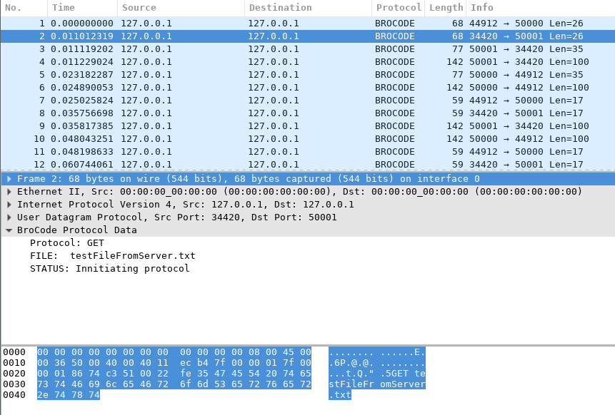

# Nets Lua Dissector


## General description
Dissectors are meant to analyze some part of a packet's data, make them more readable for 
human eyes with meaningful sections.


## How to run
In order to run, you just need to record via sudo wire-shark our protocols sending packets.
Afterwards you can run this lua dissector via this command

``wireshark-gtk -X lua_script:yourprotocol.lua``

### Implementation
Our code was fairly similar to the one provided by Adrian Veliz. We just made it a bit more
modular and changed the conditions to match our messages.

For starters we had to make sure we were using a udp dissector table, since our protocols
use UDP, and use the correct ports as such:

```
-- load the udp.port table 
udp_table = DissectorTable.get("udp.port") 
-- register protocol to handle udp ports 
udp_table:add(50000,brocode_proto) 
udp_table:add(50001,brocode_proto) 
udp_table:add(50002,brocode_proto)

```
Another important difference in our code is that we always print at the end of our dissctor
that way it is more modular and we only change the different variables "protocol", "file",
and "status" and print them at the end.


